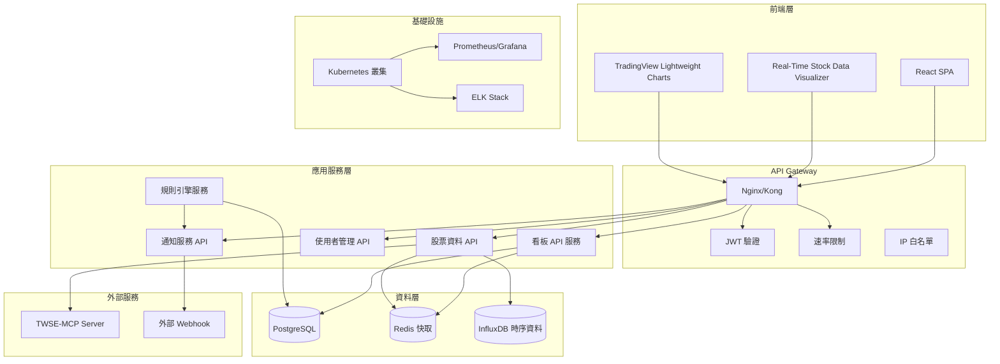
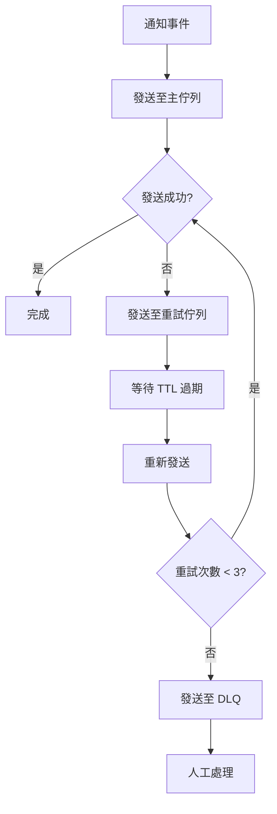
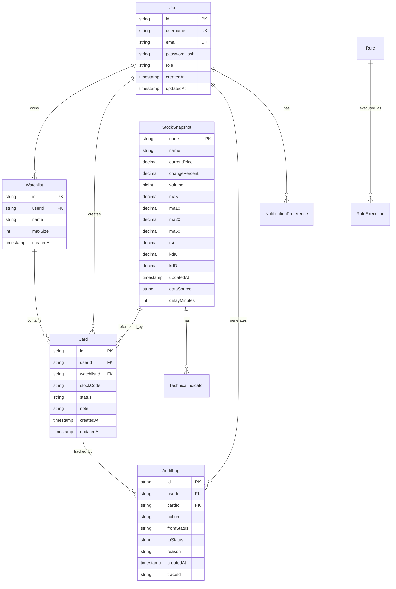
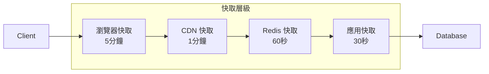
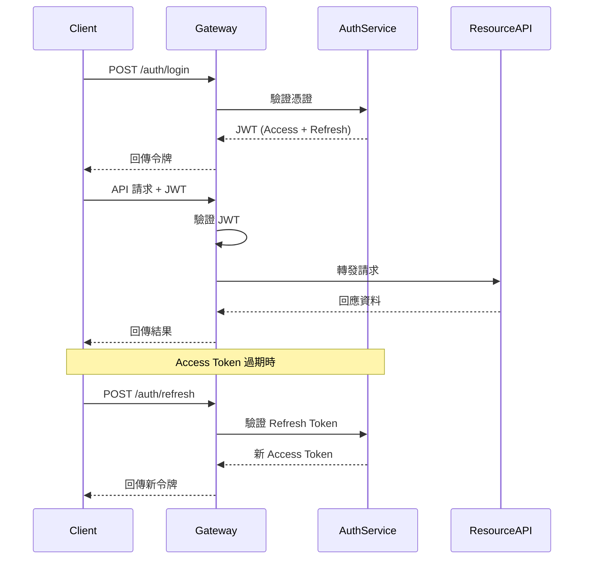
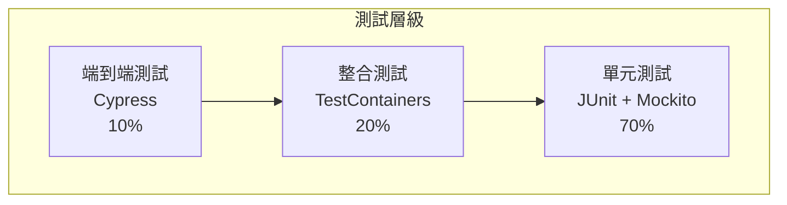

# 系統設計文件

## 概述

台股看板式追蹤面板是一個基於微服務架構的 Web 應用程式，整合 TWSE-MCP Server 提供即時股票資料，透過視覺化看板介面讓使用者管理投資組合。系統採用前後端分離架構，支援自動規則引擎、互動式圖表與多語言介面。

## 系統架構

### 整體架構圖



### 技術堆疊

| 層級 | 技術選擇 | 理由 |
|------|----------|------|
| 前端 | React 18.2 + TypeScript 5.0 | 成熟生態系、TypeScript 型別安全 |
| 圖表 | Real-Time Stock Data Visualizer + TradingView Lightweight | 即時資料視覺化、金融圖表專業 |
| 後端 | Spring Boot 3.2 + Java 21 | 企業級穩定性、豐富中介軟體 |
| 資料庫 | PostgreSQL 15 | ACID 特性、JSON 支援、效能佳 |
| 快取 | Redis 7 | 高效能、支援多種資料結構 |
| 時序資料 | InfluxDB 2.7 | 專為時序資料最佳化，90天保留策略 |
| 訊息佇列 | RabbitMQ | 可靠性高、支援多種模式 |
| 容器化 | Docker + Kubernetes | 標準化部署、自動擴展 |
| 監控 | Prometheus + Grafana | 開源標準、豐富視覺化 |
| 日誌 | ELK Stack | 集中化日誌管理、強大搜尋 |

## 核心元件設計

### 1. 看板管理服務 (KanbanAPI)

**職責：** 管理看板卡片、狀態流轉、使用者操作

**核心類別：**
```java
@RestController
@RequestMapping("/api/kanban")
public class KanbanController {
    
    @GetMapping("/cards")
    public ResponseEntity<PagedResponse<CardDto>> getCards(
        @RequestParam(required = false) String q,
        @RequestParam(required = false) String status,
        @RequestParam(defaultValue = "0") int page,
        @RequestParam(defaultValue = "50") int size,
        @RequestParam(defaultValue = "updatedAt") String sort
    );
    
    @PatchMapping("/cards/{id}")
    public ResponseEntity<CardDto> updateCard(
        @PathVariable String id,
        @RequestBody CardUpdateRequest request
    );
}

@Entity
public class Card {
    private String id;
    private String userId;
    private String stockCode;
    private String stockName;
    private CardStatus status;
    private String note;
    private LocalDateTime createdAt;
    private LocalDateTime updatedAt;
}
```

**狀態管理：**
```java
public enum CardStatus {
    WATCH("觀察"),
    READY_TO_BUY("準備買進"),
    HOLD("持有"),
    SELL("賣出"),
    ALERTS("警示");
}
```

### 2. 股票資料服務 (StockAPI)

**職責：** 整合 TWSE-MCP、計算技術指標、快取管理

**核心介面：**
```java
@Service
public class StockDataService {
    
    @Cacheable(value = "stock-snapshot", key = "#code")
    public StockSnapshot getSnapshot(String code);
    
    @Async
    public CompletableFuture<Void> updateAllSnapshots();
    
    public TechnicalIndicators calculateIndicators(String code, int period);
}

@Entity
public class StockSnapshot {
    private String code;
    private String name;
    private BigDecimal currentPrice;
    private BigDecimal changePercent;
    private Long volume;
    private BigDecimal ma20;
    private BigDecimal rsi;
    private LocalDateTime updatedAt;
    private String dataSource;
    private Integer delayMinutes;
}
```

**TWSE-MCP 整合：**
```java
@Component
public class TwseMcpClient {
    
    @Retryable(value = {Exception.class}, maxAttempts = 3, 
               backoff = @Backoff(delay = 1000, multiplier = 2))
    public StockData fetchStockData(String code);
    
    @CircuitBreaker(name = "twse-mcp", fallbackMethod = "getCachedData")
    public List<StockData> fetchBatchData(List<String> codes);
}
```

### 3. 規則引擎服務 (RuleEngine)

**職責：** 執行自動化規則、觸發卡片狀態變更

**規則定義：**
```java
@Entity
public class Rule {
    private String id;
    private String name;
    private String condition; // SpEL 表達式
    private CardStatus targetStatus;
    private boolean enabled;
    private Integer cooldownSeconds;
}

@Service
public class RuleEngineService {
    
    @Autowired
    private SimpMessagingTemplate messagingTemplate;
    
    @Scheduled(fixedDelay = 60000) // 每分鐘執行
    public void evaluateRules();
    
    public boolean evaluateCondition(String condition, StockSnapshot snapshot);
    
    // 規則觸發時即時推送標記
    public void triggerRule(String stockCode, Rule rule, StockSnapshot snapshot) {
        RuleMarkerEvent markerEvent = RuleMarkerEvent.builder()
            .stockCode(stockCode)
            .ruleId(rule.getId())
            .ruleName(rule.getName())
            .ruleType(determineRuleType(rule.getTargetStatus()))
            .timestamp(Instant.now())
            .triggerPrice(snapshot.getCurrentPrice())
            .description(rule.getDescription())
            .build();
        
        // WebSocket 即時推送
        messagingTemplate.convertAndSend(
            "/topic/rule-markers/" + stockCode, 
            markerEvent
        );
        
        // 儲存至資料庫供後續查詢
        ruleMarkerRepository.save(markerEvent);
    }
}

@Controller
public class RuleMarkerWebSocketController {
    
    @MessageMapping("/subscribe-markers/{stockCode}")
    @SendTo("/topic/rule-markers/{stockCode}")
    public void subscribeToRuleMarkers(@DestinationVariable String stockCode) {
        // 訂閱特定股票的規則標記
    }
}
```

**預設規則範例：**
```java
// 規則 1: 漲幅 >= 3% 且量比 >= 1.5 → 準備買進
"#{snapshot.changePercent >= 3.0 && snapshot.volumeRatio >= 1.5}"

// 規則 2: 股價突破 MA20 → 準備買進  
"#{snapshot.currentPrice > snapshot.ma20 && snapshot.previousPrice <= snapshot.previousMa20}"

// 規則 3: RSI > 70 且狀態為持有 → 賣出
"#{snapshot.rsi > 70 && card.status == T(CardStatus).HOLD}"
```

### 4. 即時圖表服務 (ChartAPI)

**職責：** 整合 Real-Time Stock Data Visualizer，提供即時圖表資料

**核心功能：**
```javascript
// Real-Time Stock Data Visualizer 整合
class StockChartManager {
    constructor(containerId, options) {
        this.visualizer = new RealTimeStockDataVisualizer({
            container: containerId,
            theme: 'light',
            locale: 'zh-TW',
            timezone: 'Asia/Taipei',
            ...options
        });
    }
    
    // 初始化迷你圖表（卡片用）
    initMiniChart(stockCode, period = '30D') {
        return this.visualizer.createMiniChart({
            symbol: stockCode,
            period: period,
            indicators: ['MA20'],
            height: 120,
            showVolume: false
        });
    }
    
    // 初始化完整圖表（彈窗用）
    initFullChart(stockCode) {
        return this.visualizer.createFullChart({
            symbol: stockCode,
            periods: ['1M', '3M', '6M', '1Y'],
            indicators: ['MA5', 'MA10', 'MA20', 'RSI', 'KD', 'MACD'],
            candlestick: true,
            volume: true,
            crosshair: true,
            zoom: true
        });
    }
    
    // 即時資料更新
    updateRealTimeData(stockCode, data) {
        this.visualizer.updateData(stockCode, {
            timestamp: data.timestamp,
            open: data.open,
            high: data.high,
            low: data.low,
            close: data.close,
            volume: data.volume
        });
    }
    
    // 規則觸發標記顯示
    addRuleMarker(stockCode, marker) {
        this.visualizer.addMarker(stockCode, {
            time: marker.timestamp,
            position: 'aboveBar',
            color: marker.color,
            shape: marker.ruleType === 'BUY_SIGNAL' ? 'arrowUp' : 'arrowDown',
            text: marker.description
        });
    }
    
    // 規則觸發標記範例
    showRuleTriggerMarkers(stockCode, triggers) {
        triggers.forEach(trigger => {
            const marker = {
                timestamp: trigger.timestamp,
                ruleType: trigger.action === 'MOVE_TO_BUY' ? 'BUY_SIGNAL' : 'SELL_SIGNAL',
                description: `${trigger.ruleName}: ${trigger.condition}`,
                color: trigger.action === 'MOVE_TO_BUY' ? '#00C851' : '#FF4444'
            };
            this.addRuleMarker(stockCode, marker);
        });
    }
}
```

**圖表資料 API：**
```java
@RestController
@RequestMapping("/api/charts")
public class ChartController {
    
    @GetMapping("/stocks/{code}/ohlc")
    public ResponseEntity<OHLCDataResponse> getOHLCData(
        @PathVariable String code,
        @RequestParam String period,
        @RequestParam(required = false) String indicators
    );
    
    @GetMapping("/stocks/{code}/realtime")
    public SseEmitter getRealTimeData(
        @PathVariable String code,
        @RequestParam(defaultValue = "1000") int intervalMs
    ); // 最小間隔 1 秒，防止流量爆炸
    
    @GetMapping("/stocks/{code}/rule-markers")
    public ResponseEntity<RuleMarkerResponse> getRuleMarkers(
        @PathVariable String code,
        @RequestParam String startDate,
        @RequestParam String endDate
    );
}

// 規則標記 API 回傳格式
@Data
public class RuleMarkerResponse {
    private List<RuleMarkerDto> markers;
    private String stockCode;
    private LocalDateTime generatedAt;
}

@Data
public class RuleMarkerDto {
    private LocalDateTime timestamp;
    private BigDecimal price;
    private String ruleId;
    private String ruleName;
    private String ruleType; // BUY_SIGNAL, SELL_SIGNAL, ALERT
    private String description;
    private String color;
    private String shape; // arrowUp, arrowDown, circle, triangle
}
```

@Entity
public class OHLCData {
    private String stockCode;
    private LocalDateTime timestamp;
    private BigDecimal open;
    private BigDecimal high;
    private BigDecimal low;
    private BigDecimal close;
    private Long volume;
}
```

### 5. 通知服務 (NotifyAPI)

**職責：** 管理推播通知、Webhook 整合、重試機制

```java
@Service
public class NotificationService {
    
    @RabbitListener(queues = "notification.queue")
    public void processNotification(NotificationMessage message);
    
    @Retryable(value = {Exception.class}, maxAttempts = 3)
    public void sendPushNotification(String userId, NotificationDto notification);
    
    @Async
    public void sendWebhook(String url, WebhookPayload payload);
    
    @EventListener
    public void handleCardStatusChanged(CardStatusChangedEvent event);
}

// RabbitMQ 重試策略配置
@Configuration
public class RabbitMQConfig {
    
    @Bean
    public Queue notificationQueue() {
        return QueueBuilder.durable("notification.queue")
            .withArgument("x-dead-letter-exchange", "notification.dlx")
            .withArgument("x-dead-letter-routing-key", "failed")
            .build();
    }
    
    @Bean
    public Queue retryQueue() {
        return QueueBuilder.durable("notification.retry.queue")
            .withArgument("x-message-ttl", 60000) // 1分鐘後重試
            .withArgument("x-dead-letter-exchange", "notification.exchange")
            .withArgument("x-dead-letter-routing-key", "notification")
            .build();
    }
    
    @Bean
    public Queue deadLetterQueue() {
        return QueueBuilder.durable("notification.failed.queue").build();
    }
}

@Entity
public class NotificationPreference {
    private String userId;
    private boolean pushEnabled;
    private boolean emailEnabled;
    private boolean webhookEnabled;
    private String webhookUrl;
    private int maxRetries = 3;
    private int retryDelaySeconds = 60;
}
```

**通知重試流程圖：**

```

## 資料模型設計

### 核心實體關係圖



### 資料庫索引策略

```sql
-- 複合索引優化查詢效能
CREATE INDEX idx_card_user_status ON card(user_id, status, updated_at DESC);
CREATE INDEX idx_card_stock_code ON card(stock_code);
CREATE INDEX idx_audit_log_user_time ON audit_log(user_id, created_at DESC);
CREATE INDEX idx_stock_snapshot_updated ON stock_snapshot(updated_at DESC);

-- 唯一約束
CREATE UNIQUE INDEX uk_card_user_stock ON card(user_id, stock_code) WHERE status != 'ARCHIVED';
CREATE UNIQUE INDEX uk_user_email ON user(email);
```

## API 設計規範

### RESTful API 端點

| 方法 | 端點 | 描述 | 請求參數 | 回應格式 |
|------|------|------|----------|----------|
| GET | `/api/kanban/cards` | 取得看板卡片 | q, status, page, size, sort | PagedResponse<CardDto> |
| PATCH | `/api/kanban/cards/{id}` | 更新卡片狀態 | CardUpdateRequest | CardDto |
| POST | `/api/watchlist` | 新增觀察清單 | WatchlistCreateRequest | WatchlistDto |
| DELETE | `/api/watchlist/{code}` | 移除股票 | - | SuccessResponse |
| GET | `/api/stocks/{code}/snapshot` | 取得股票快照 | - | StockSnapshotDto |
| GET | `/api/charts/stocks/{code}/ohlc` | 取得 OHLC 圖表資料 | period, indicators | OHLCDataResponse |
| GET | `/api/charts/stocks/{code}/realtime` | 即時資料串流 | - | Server-Sent Events |
| POST | `/api/auth/login` | 使用者登入 | LoginRequest | AuthResponse |
| POST | `/api/auth/refresh` | 更新令牌 | RefreshRequest | AuthResponse |

### 統一回應格式

```json
{
  "success": true,
  "data": {
    "cards": [...],
    "pagination": {
      "page": 0,
      "size": 50,
      "totalElements": 150,
      "totalPages": 3
    }
  },
  "meta": {
    "timestamp": "2024-01-15T10:30:00Z",
    "traceId": "abc123",
    "version": "1.0.0"
  }
}
```

### 錯誤回應格式

```json
{
  "success": false,
  "error": {
    "code": "STOCK_NOT_FOUND",
    "message": "指定的股票代碼不存在",
    "hint": "請檢查股票代碼是否正確",
    "traceId": "xyz789",
    "timestamp": "2024-01-15T10:30:00Z"
  }
}
```

## 效能最佳化策略

### 快取架構



**快取策略：**
- **股票快照：** Redis 快取 60 秒，盤中更新頻率高
- **技術指標：** Redis 快取 300 秒，計算成本高
- **使用者資料：** 應用層快取 1800 秒，變更頻率低
- **靜態資源：** CDN 快取 86400 秒，版本化管理

### 資料庫最佳化

**讀寫分離：**
```yaml
datasource:
  master:
    url: jdbc:postgresql://master-db:5432/kanban
    username: ${DB_USER}
    password: ${DB_PASSWORD}
  slave:
    url: jdbc:postgresql://slave-db:5432/kanban
    username: ${DB_USER}
    password: ${DB_PASSWORD}
```

**連線池設定：**
```yaml
hikari:
  maximum-pool-size: 20
  minimum-idle: 5
  connection-timeout: 30000
  idle-timeout: 600000
  max-lifetime: 1800000
```

**InfluxDB 保留策略與資料降採樣：**
```sql
-- 建立保留策略
CREATE RETENTION POLICY "stock_data_90d" ON "kanban_db" 
DURATION 90d REPLICATION 1 DEFAULT;

-- 建立連續查詢進行資料降採樣
CREATE CONTINUOUS QUERY "downsample_1h" ON "kanban_db"
BEGIN
  SELECT mean("close") AS "close", mean("volume") AS "volume",
         first("open") AS "open", max("high") AS "high", min("low") AS "low"
  INTO "stock_data_90d"."stock_hourly"
  FROM "stock_data_90d"."stock_realtime"
  GROUP BY time(1h), "stock_code"
END;

-- 日線資料降採樣
CREATE CONTINUOUS QUERY "downsample_1d" ON "kanban_db"
BEGIN
  SELECT mean("close") AS "close", sum("volume") AS "volume",
         first("open") AS "open", max("high") AS "high", min("low") AS "low"
  INTO "stock_data_90d"."stock_daily"
  FROM "stock_data_90d"."stock_hourly"
  GROUP BY time(1d), "stock_code"
END;
```

**SSE 資料流控制：**
```java
@Component
public class SseConnectionManager {
    private final Map<String, Set<SseEmitter>> connections = new ConcurrentHashMap<>();
    private final AtomicInteger activeConnections = new AtomicInteger(0);
    private static final int MAX_CONNECTIONS = 1000;
    
    // Auto-scaling 條件配置
    @Value("${sse.auto-scale.enabled:true}")
    private boolean autoScaleEnabled;
    
    @Value("${sse.auto-scale.threshold:0.8}")
    private double scaleThreshold; // 80% 使用率時觸發擴展
    private static final int MIN_INTERVAL_MS = 1000;
    
    public SseEmitter createConnection(String stockCode, int intervalMs) {
        if (activeConnections.get() >= MAX_CONNECTIONS) {
            throw new TooManyConnectionsException("超過最大連線數限制");
        }
        
        int actualInterval = Math.max(intervalMs, MIN_INTERVAL_MS);
        SseEmitter emitter = new SseEmitter(Long.MAX_VALUE);
        
        connections.computeIfAbsent(stockCode, k -> ConcurrentHashMap.newKeySet())
                  .add(emitter);
        activeConnections.incrementAndGet();
        
        emitter.onCompletion(() -> removeConnection(stockCode, emitter));
        emitter.onTimeout(() -> removeConnection(stockCode, emitter));
        
        return emitter;
    }
    
    // 多 Topic 分層廣播策略
    @Scheduled(fixedDelay = 1000)
    public void broadcastUpdates() {
        // 熱門股票（高頻更新）
        broadcastByTopic("hot-stocks", getHotStocks());
        
        // 一般股票（標準頻率）
        broadcastByTopic("regular-stocks", getRegularStocks());
        
        // 冷門股票（低頻更新）
        if (System.currentTimeMillis() % 5000 == 0) { // 每5秒更新一次
            broadcastByTopic("cold-stocks", getColdStocks());
        }
    }
    
    private void broadcastByTopic(String topic, List<String> stockCodes) {
        stockCodes.forEach(stockCode -> {
            Set<SseEmitter> emitters = connections.get(stockCode);
            if (emitters != null && !emitters.isEmpty()) {
                StockSnapshot snapshot = stockService.getSnapshot(stockCode);
                if (snapshot != null) {
                    emitters.removeIf(emitter -> {
                        try {
                            emitter.send(SseEmitter.event()
                                .name("stock-update")
                                .data(snapshot)
                                .id(UUID.randomUUID().toString()));
                            return false;
                        } catch (Exception e) {
                            activeConnections.decrementAndGet();
                            return true; // 移除失效連線
                        }
                    });
                }
            }
        });
    }
}
```

## 安全性設計

### 認證與授權流程



### 資料加密與保護

**傳輸加密：**
- 強制 HTTPS/TLS 1.3
- HSTS 標頭防止降級攻擊
- Certificate Pinning 防止中間人攻擊

**資料加密：**
```java
@Entity
public class User {
    @Column(name = "password_hash")
    @Convert(converter = BCryptConverter.class)
    private String passwordHash;
    
    @Column(name = "email")
    @Convert(converter = AESConverter.class)
    private String email;
}
```

**敏感資料遮罩：**
```java
@JsonSerialize(using = MaskingSerializer.class)
private String email; // 顯示為 u***@example.com
```

## 錯誤處理策略

### 全域異常處理

```java
@ControllerAdvice
public class GlobalExceptionHandler {
    
    @ExceptionHandler(StockNotFoundException.class)
    public ResponseEntity<ErrorResponse> handleStockNotFound(StockNotFoundException ex) {
        return ResponseEntity.status(404)
            .body(ErrorResponse.builder()
                .code("STOCK_NOT_FOUND")
                .message("指定的股票代碼不存在")
                .hint("請檢查股票代碼格式是否正確")
                .traceId(MDC.get("traceId"))
                .timestamp(Instant.now())
                .build());
    }
    
    @ExceptionHandler(TwseMcpException.class)
    public ResponseEntity<ErrorResponse> handleTwseMcpError(TwseMcpException ex) {
        return ResponseEntity.status(503)
            .body(ErrorResponse.builder()
                .code("EXTERNAL_SERVICE_UNAVAILABLE")
                .message("股票資料服務暫時無法使用")
                .hint("請稍後再試，或查看快取資料")
                .traceId(MDC.get("traceId"))
                .timestamp(Instant.now())
                .build());
    }
}
```

### 斷路器模式

```java
@Component
public class TwseMcpClient {
    
    @CircuitBreaker(name = "twse-mcp", fallbackMethod = "fallbackGetStockData")
    @TimeLimiter(name = "twse-mcp")
    @Retry(name = "twse-mcp")
    public CompletableFuture<StockData> getStockData(String code) {
        return CompletableFuture.supplyAsync(() -> {
            // 呼叫 TWSE-MCP API
            return twseMcpApi.fetchStock(code);
        });
    }
    
    public CompletableFuture<StockData> fallbackGetStockData(String code, Exception ex) {
        // 回傳快取資料
        return CompletableFuture.completedFuture(
            stockCacheService.getCachedData(code)
        );
    }
}
```

## 測試策略

### 測試金字塔



### 測試覆蓋率目標

| 測試類型 | 覆蓋率目標 | 工具 | 範圍 |
|----------|------------|------|------|
| 單元測試 | 80% | JUnit 5 + Mockito | 業務邏輯、工具類別 |
| 整合測試 | 60% | TestContainers | API 端點、資料庫操作 |
| 端到端測試 | 主要流程 | Cypress | 使用者關鍵路徑 |
| 效能測試 | 基準驗證 | K6 | 負載、壓力測試 |

### 效能測試配置

**K6 負載測試場景：**
```javascript
import http from 'k6/http';
import { check, sleep } from 'k6';

export let options = {
  stages: [
    { duration: '2m', target: 100 },   // 暖身階段
    { duration: '5m', target: 500 },   // 正常負載
    { duration: '10m', target: 1000 }, // 高負載測試
    { duration: '3m', target: 1500 },  // 峰值測試
    { duration: '5m', target: 0 },     // 降載階段
  ],
  thresholds: {
    http_req_duration: ['p(95)<300'], // 95% 請求 < 300ms
    http_req_failed: ['rate<0.01'],   // 錯誤率 < 1%
  },
};

export default function () {
  // 測試看板 API
  let response = http.get('https://api.kanban.com/api/kanban/cards?page=0&size=50');
  check(response, {
    'status is 200': (r) => r.status === 200,
    'response time < 300ms': (r) => r.timings.duration < 300,
  });
  
  // 測試股票快照 API
  response = http.get('https://api.kanban.com/api/stocks/2330/snapshot');
  check(response, {
    'stock data available': (r) => r.json('data.currentPrice') !== null,
  });
  
  sleep(1);
}
```

### 測試資料管理

```java
@TestConfiguration
public class TestDataConfig {
    
    @Bean
    @Primary
    public StockDataService mockStockDataService() {
        StockDataService mock = Mockito.mock(StockDataService.class);
        
        // 模擬台積電資料
        when(mock.getSnapshot("2330")).thenReturn(
            StockSnapshot.builder()
                .code("2330")
                .name("台積電")
                .currentPrice(new BigDecimal("580.00"))
                .changePercent(new BigDecimal("2.5"))
                .volume(25000000L)
                .ma20(new BigDecimal("575.00"))
                .rsi(new BigDecimal("65.5"))
                .build()
        );
        
        return mock;
    }
}
```

## 國際化 (i18n) 架構

### 多語系實作策略

```typescript
// i18next 配置
import i18n from 'i18next';
import { initReactI18next } from 'react-i18next';

// 語言資源檔案結構（支援亞太地區）
const resources = {
  'zh-TW': {
    translation: {
      kanban: {
        columns: {
          watch: '觀察',
          readyToBuy: '準備買進',
          hold: '持有',
          sell: '賣出',
          alerts: '警示'
        },
        actions: {
          moveCard: '移動卡片',
          addStock: '新增股票',
          removeStock: '移除股票'
        }
      },
      chart: {
        indicators: {
          ma: '移動平均',
          rsi: '相對強弱指標',
          kd: 'KD指標'
        },
        timeframes: {
          '1M': '1個月',
          '3M': '3個月',
          '6M': '6個月',
          '1Y': '1年'
        }
      }
    }
  },
  'en-US': {
    translation: {
      kanban: {
        columns: {
          watch: 'Watch',
          readyToBuy: 'Ready to Buy',
          hold: 'Hold',
          sell: 'Sell',
          alerts: 'Alerts'
        },
        actions: {
          moveCard: 'Move Card',
          addStock: 'Add Stock',
          removeStock: 'Remove Stock'
        }
      },
      chart: {
        indicators: {
          ma: 'Moving Average',
          rsi: 'RSI',
          kd: 'KD Indicator'
        }
      }
    }
  },
  'ja-JP': {
    translation: {
      kanban: {
        columns: {
          watch: 'ウォッチ',
          readyToBuy: '購入準備',
          hold: '保有',
          sell: '売却',
          alerts: 'アラート'
        }
      }
    }
  },
  'ko-KR': {
    translation: {
      kanban: {
        columns: {
          watch: '관찰',
          readyToBuy: '매수 준비',
          hold: '보유',
          sell: '매도',
          alerts: '경고'
        }
      }
    }
  },
  'vi-VN': {
    translation: {
      kanban: {
        columns: {
          watch: 'Theo dõi',
          readyToBuy: 'Sẵn sàng mua',
          hold: 'Nắm giữ',
          sell: 'Bán',
          alerts: 'Cảnh báo'
        }
      }
    }
  },
  'th-TH': {
    translation: {
      kanban: {
        columns: {
          watch: 'เฝ้าดู',
          readyToBuy: 'พร้อมซื้อ',
          hold: 'ถือครอง',
          sell: 'ขาย',
          alerts: 'แจ้งเตือน'
        }
      }
    }
  }
};

// WebSocket 規則標記事件
class RuleMarkerWebSocket {
  private ws: WebSocket;
  
  connect(stockCode: string) {
    this.ws = new WebSocket(`wss://api.kanban.com/ws/rule-markers/${stockCode}`);
    
    this.ws.onmessage = (event) => {
      const markerEvent = JSON.parse(event.data);
      if (markerEvent.type === 'RULE_TRIGGERED') {
        this.handleRuleMarker(markerEvent.data);
      }
    };
  }
  
  private handleRuleMarker(markerData: any) {
    // 即時在圖表上顯示規則觸發標記
    ChartManager.addRealTimeMarker(markerData.stockCode, {
      timestamp: new Date(markerData.timestamp),
      price: markerData.triggerPrice,
      ruleType: markerData.ruleType,
      description: markerData.description,
      color: markerData.ruleType === 'BUY_SIGNAL' ? '#00C851' : '#FF4444'
    });
    
    // 發送通知
    NotificationManager.showRuleAlert(markerData);
  }
}

i18n
  .use(initReactI18next)
  .init({
    resources,
    lng: localStorage.getItem('language') || 'zh-TW',
    fallbackLng: 'zh-TW',
    interpolation: {
      escapeValue: false
    }
  });

// 語言切換與偏好快取
class LanguageManager {
  static setLanguage(lang: string) {
    i18n.changeLanguage(lang);
    localStorage.setItem('language', lang);
    // 同步更新圖表語言
    this.updateChartLocale(lang);
  }
  
  static updateChartLocale(lang: string) {
    // 更新所有圖表實例的語言設定
    ChartManager.updateAllChartsLocale(lang);
  }
}
```

## 前端圖表整合架構

### Real-Time Stock Data Visualizer 配置

```typescript
// 圖表配置介面
interface ChartConfig {
  theme: 'light' | 'dark';
  locale: 'zh-TW' | 'en-US';
  timezone: string;
  updateInterval: number; // 毫秒
  maxDataPoints: number;
  autoReconnect: boolean; // 自動重連
  showRuleMarkers: boolean; // 顯示規則觸發標記
}

// 使用者偏好設定與快取
interface UserPreferences {
  chartTheme: 'light' | 'dark' | 'auto';
  defaultTimeRange: string;
  enableAnimations: boolean;
  autoRefresh: boolean;
}

// 使用者偏好儲存結構
interface StoredUserPreferences {
  theme: 'light' | 'dark' | 'auto';
  language: 'zh-TW' | 'en-US';
  chartSettings: {
    defaultTimeRange: string;
    enableAnimations: boolean;
    autoRefresh: boolean;
    showVolume: boolean;
    showIndicators: string[];
  };
  notifications: {
    pushEnabled: boolean;
    emailEnabled: boolean;
    soundEnabled: boolean;
  };
}

class UserPreferenceManager {
  private static readonly KEYS = {
    THEME: 'kanban-theme-preference',
    LANGUAGE: 'kanban-language-preference', 
    CHART_SETTINGS: 'kanban-chart-settings',
    NOTIFICATIONS: 'kanban-notification-settings',
    FULL_PREFERENCES: 'kanban-user-preferences'
  };
  
  static setTheme(theme: 'light' | 'dark' | 'auto') {
    localStorage.setItem(this.KEYS.THEME, theme);
    this.updateFullPreferences({ theme });
    this.applyTheme(theme);
  }
  
  static getTheme(): string {
    return localStorage.getItem(this.KEYS.THEME) || 'auto';
  }
  
  static setChartSettings(settings: any) {
    localStorage.setItem(this.KEYS.CHART_SETTINGS, JSON.stringify(settings));
    this.updateFullPreferences({ chartSettings: settings });
  }
  
  static getFullPreferences(): StoredUserPreferences {
    // 優先使用 localStorage，回退至 sessionStorage
    let stored = localStorage.getItem(this.KEYS.FULL_PREFERENCES);
    if (!stored) {
      stored = sessionStorage.getItem(this.KEYS.FULL_PREFERENCES);
      if (stored) {
        // 將 sessionStorage 資料同步至 localStorage
        localStorage.setItem(this.KEYS.FULL_PREFERENCES, stored);
      }
    }
    return stored ? JSON.parse(stored) : this.getDefaultPreferences();
  }
  
  static syncToSession() {
    // 跨裝置衝突時的回退機制
    const prefs = this.getFullPreferences();
    sessionStorage.setItem(this.KEYS.FULL_PREFERENCES, JSON.stringify(prefs));
  }
  
  private static updateFullPreferences(updates: Partial<StoredUserPreferences>) {
    const current = this.getFullPreferences();
    const updated = { ...current, ...updates };
    localStorage.setItem(this.KEYS.FULL_PREFERENCES, JSON.stringify(updated));
  }
  
  private static getDefaultPreferences(): StoredUserPreferences {
    return {
      theme: 'auto',
      language: 'zh-TW',
      chartSettings: {
        defaultTimeRange: '3M',
        enableAnimations: true,
        autoRefresh: true,
        showVolume: true,
        showIndicators: ['MA20', 'RSI']
      },
      notifications: {
        pushEnabled: true,
        emailEnabled: false,
        soundEnabled: true
      }
    };
  }
  
  static applyTheme(theme: string) {
    const actualTheme = theme === 'auto' ? this.getSystemTheme() : theme;
    document.documentElement.setAttribute('data-theme', actualTheme);
    
    // 更新所有圖表主題
    ChartManager.updateAllChartsTheme(actualTheme);
  }
  
  private static getSystemTheme(): string {
    return window.matchMedia('(prefers-color-scheme: dark)').matches ? 'dark' : 'light';
  }
}

// 規則標記介面
interface RuleMarker {
  timestamp: Date;
  price: number;
  ruleType: 'BUY_SIGNAL' | 'SELL_SIGNAL' | 'ALERT';
  description: string;
  color: string;
}

// 卡片迷你圖表元件
const MiniChart: React.FC<{stockCode: string}> = ({ stockCode }) => {
  const chartRef = useRef<HTMLDivElement>(null);
  const [visualizer, setVisualizer] = useState<RealTimeStockDataVisualizer>();
  
  useEffect(() => {
    if (chartRef.current) {
      const chart = new RealTimeStockDataVisualizer({
        container: chartRef.current,
        theme: 'light',
        locale: 'zh-TW',
        height: 120,
        showControls: false,
        showVolume: false
      });
      
      // 載入歷史資料
      chart.loadHistoricalData(stockCode, '30D');
      
      // 訂閱即時更新
      const eventSource = new EventSource(`/api/charts/stocks/${stockCode}/realtime`);
      eventSource.onmessage = (event) => {
        const data = JSON.parse(event.data);
        chart.updateRealTimeData(data);
      };
      
      setVisualizer(chart);
      
      return () => {
        eventSource.close();
        chart.destroy();
      };
    }
  }, [stockCode]);
  
  return <div ref={chartRef} className="mini-chart" />;
};

// 完整圖表彈窗元件
const FullChartModal: React.FC<{stockCode: string, isOpen: boolean}> = ({ stockCode, isOpen }) => {
  const [chart, setChart] = useState<RealTimeStockDataVisualizer>();
  
  useEffect(() => {
    if (isOpen && !chart) {
      const fullChart = new RealTimeStockDataVisualizer({
        container: 'full-chart-container',
        theme: 'light',
        locale: 'zh-TW',
        height: 600,
        showControls: true,
        indicators: ['MA5', 'MA10', 'MA20', 'RSI', 'KD', 'MACD'],
        candlestick: true,
        volume: true
      });
      
      fullChart.loadHistoricalData(stockCode, '1Y');
      setChart(fullChart);
    }
  }, [isOpen, stockCode]);
  
  return (
    <Modal isOpen={isOpen}>
      <div id="full-chart-container" />
    </Modal>
  );
};
```

### 效能最佳化策略

**圖表資料快取：**
```typescript
class ChartDataCache {
  private cache = new Map<string, CacheEntry>();
  private readonly TTL = 60000; // 1分鐘
  
  get(key: string): any | null {
    const entry = this.cache.get(key);
    if (entry && Date.now() - entry.timestamp < this.TTL) {
      return entry.data;
    }
    this.cache.delete(key);
    return null;
  }
  
  set(key: string, data: any): void {
    this.cache.set(key, {
      data,
      timestamp: Date.now()
    });
  }
}
```

**即時資料連線管理（含錯誤復原）：**
```typescript
class RealTimeDataManager {
  private connections = new Map<string, EventSource>();
  private reconnectAttempts = new Map<string, number>();
  private maxReconnectAttempts = 5;
  
  subscribe(stockCode: string, callback: (data: any) => void): void {
    this.createConnection(stockCode, callback);
  }
  
  private createConnection(stockCode: string, callback: (data: any) => void): void {
    const eventSource = new EventSource(`/api/charts/stocks/${stockCode}/realtime`);
    
    eventSource.onmessage = (event) => {
      const data = JSON.parse(event.data);
      callback(data);
      // 重置重連計數
      this.reconnectAttempts.set(stockCode, 0);
    };
    
    eventSource.onerror = (error) => {
      console.error(`SSE connection error for ${stockCode}:`, error);
      eventSource.close();
      this.handleReconnect(stockCode, callback);
    };
    
    this.connections.set(stockCode, eventSource);
  }
  
  private handleReconnect(stockCode: string, callback: (data: any) => void): void {
    const attempts = this.reconnectAttempts.get(stockCode) || 0;
    
    if (attempts < this.maxReconnectAttempts) {
      const delay = Math.pow(2, attempts) * 1000; // 指數退避
      setTimeout(() => {
        console.log(`Reconnecting to ${stockCode}, attempt ${attempts + 1}`);
        this.reconnectAttempts.set(stockCode, attempts + 1);
        this.createConnection(stockCode, callback);
      }, delay);
    } else {
      // 顯示離線提示
      callback({
        type: 'CONNECTION_FAILED',
        message: '即時資料連線中斷，請重新整理頁面'
      });
    }
  }
  
  unsubscribe(stockCode: string): void {
    const connection = this.connections.get(stockCode);
    if (connection) {
      connection.close();
      this.connections.delete(stockCode);
      this.reconnectAttempts.delete(stockCode);
    }
  }
}

// 圖表錯誤處理元件
const ChartErrorBoundary: React.FC<{children: React.ReactNode}> = ({ children }) => {
  const [hasError, setHasError] = useState(false);
  const [errorMessage, setErrorMessage] = useState('');
  
  const handleRetry = () => {
    setHasError(false);
    setErrorMessage('');
  };
  
  if (hasError) {
    return (
      <div className="chart-error">
        <p>圖表載入失敗：{errorMessage}</p>
        <button onClick={handleRetry}>重試</button>
      </div>
    );
  }
  
  return <>{children}</>;
};
```
```

## API Gateway 安全策略

### Kong 速率限制配置

```yaml
# Kong 速率限制插件配置
plugins:
- name: rate-limiting
  config:
    minute: 100        # 每分鐘 100 次請求
    hour: 1000         # 每小時 1000 次請求
    day: 10000         # 每日 10000 次請求
    policy: redis      # 使用 Redis 儲存計數器
    redis_host: redis-cluster
    redis_port: 6379
    fault_tolerant: true
    hide_client_headers: false

# 不同端點的差異化限制
- name: rate-limiting-advanced
  route: kanban-api
  config:
    limit:
      - minute: 200    # 看板 API 較高限制
    window_size: [60]
    identifier: consumer
    sync_rate: 10

- name: rate-limiting-advanced  
  route: stock-realtime
  config:
    limit:
      - minute: 60     # 即時資料較低限制
    window_size: [60]
    identifier: ip
    
# IP 白名單（內部服務）
- name: ip-restriction
  config:
    allow: ["10.0.0.0/8", "172.16.0.0/12", "192.168.0.0/16"]
    deny: []
```

### Nginx 速率限制配置

```nginx
# 定義速率限制區域
http {
    limit_req_zone $binary_remote_addr zone=api:10m rate=100r/m;
    limit_req_zone $binary_remote_addr zone=realtime:10m rate=60r/m;
    limit_req_zone $jwt_user_id zone=user:10m rate=200r/m;
    
    server {
        location /api/kanban/ {
            limit_req zone=api burst=20 nodelay;
            limit_req zone=user burst=50 nodelay;
            proxy_pass http://kanban-backend;
        }
        
        location /api/stocks/*/realtime {
            limit_req zone=realtime burst=10 nodelay;
            proxy_pass http://stock-backend;
        }
        
        # 錯誤回應自定義
        error_page 429 @rate_limit_error;
        
        location @rate_limit_error {
            return 429 '{"error":{"code":"RATE_LIMIT_EXCEEDED","message":"請求頻率過高，請稍後再試"}}';
        }
    }
}
```

## API 文件化

### OpenAPI 3.0 規格定義

```yaml
openapi: 3.0.3
info:
  title: Taiwan Stock Kanban API
  description: 台股看板式追蹤面板 API 規格
  version: 1.0.0
  contact:
    name: API Support
    email: api-support@kanban.com

servers:
  - url: https://api.kanban.com/v1
    description: Production server
  - url: https://staging-api.kanban.com/v1
    description: Staging server

paths:
  /kanban/cards:
    get:
      summary: 取得看板卡片
      tags: [Kanban]
      parameters:
        - name: q
          in: query
          description: 搜尋關鍵字
          schema:
            type: string
        - name: status
          in: query
          description: 卡片狀態篩選
          schema:
            type: string
            enum: [WATCH, READY_TO_BUY, HOLD, SELL, ALERTS]
        - name: page
          in: query
          description: 頁碼
          schema:
            type: integer
            default: 0
        - name: size
          in: query
          description: 每頁筆數
          schema:
            type: integer
            default: 50
            maximum: 100
      responses:
        '200':
          description: 成功取得卡片清單
          content:
            application/json:
              schema:
                $ref: '#/components/schemas/PagedCardResponse'
        '400':
          description: 請求參數錯誤
          content:
            application/json:
              schema:
                $ref: '#/components/schemas/ErrorResponse'

  /stocks/{code}/snapshot:
    get:
      summary: 取得股票快照
      tags: [Stock]
      parameters:
        - name: code
          in: path
          required: true
          description: 股票代碼
          schema:
            type: string
            pattern: '^[0-9]{4}$'
      responses:
        '200':
          description: 成功取得股票快照
          content:
            application/json:
              schema:
                $ref: '#/components/schemas/StockSnapshotResponse'

components:
  schemas:
    CardDto:
      type: object
      properties:
        id:
          type: string
        stockCode:
          type: string
        stockName:
          type: string
        status:
          type: string
          enum: [WATCH, READY_TO_BUY, HOLD, SELL, ALERTS]
        currentPrice:
          type: number
          format: decimal
        changePercent:
          type: number
          format: decimal
        volume:
          type: integer
          format: int64
        ma20:
          type: number
          format: decimal
        rsi:
          type: number
          format: decimal
        updatedAt:
          type: string
          format: date-time
          
    ErrorResponse:
      type: object
      properties:
        success:
          type: boolean
          example: false
        error:
          type: object
          properties:
            code:
              type: string
            message:
              type: string
            hint:
              type: string
            traceId:
              type: string
            timestamp:
              type: string
              format: date-time

  securitySchemes:
    BearerAuth:
      type: http
      scheme: bearer
      bearerFormat: JWT
    OAuth2:
      type: oauth2
      flows:
        clientCredentials:
          tokenUrl: https://auth.kanban.com/oauth/token
          scopes:
            read: 讀取權限
            write: 寫入權限
            admin: 管理權限

security:
  - BearerAuth: []
  - OAuth2: [read, write]
```

**測試報告整合：**
```xml
<!-- Maven 配置 - Jacoco + Allure -->
<plugin>
    <groupId>org.jacoco</groupId>
    <artifactId>jacoco-maven-plugin</artifactId>
    <version>0.8.8</version>
    <executions>
        <execution>
            <goals>
                <goal>prepare-agent</goal>
            </goals>
        </execution>
        <execution>
            <id>report</id>
            <phase>test</phase>
            <goals>
                <goal>report</goal>
            </goals>
        </execution>
    </executions>
</plugin>

<plugin>
    <groupId>io.qameta.allure</groupId>
    <artifactId>allure-maven</artifactId>
    <version>2.12.0</version>
    <configuration>
        <reportVersion>2.21.0</reportVersion>
        <resultsDirectory>${project.build.directory}/allure-results</resultsDirectory>
    </configuration>
</plugin>
```

**測試報告生成：**
```java
@ExtendWith(AllureJunit5.class)
public class KanbanApiTest {
    
    @Test
    @DisplayName("取得看板卡片 - 成功案例")
    @Description("驗證 GET /api/kanban/cards 端點正常運作")
    @Severity(SeverityLevel.CRITICAL)
    public void testGetCards() {
        // 測試實作
    }
    
    @Step("驗證回應格式")
    public void validateResponse(Response response) {
        // 驗證步驟
    }
}
```

**Swagger UI 整合：**
```java
@Configuration
@EnableOpenApi
public class OpenApiConfig {
    
    @Bean
    public OpenAPI customOpenAPI() {
        return new OpenAPI()
            .info(new Info()
                .title("Taiwan Stock Kanban API")
                .version("1.0.0")
                .description("台股看板式追蹤面板 API 規格")
                .contact(new Contact()
                    .name("API Support")
                    .email("api-support@kanban.com")))
            .addSecurityItem(new SecurityRequirement().addList("BearerAuth"))
            .components(new Components()
                .addSecuritySchemes("BearerAuth", 
                    new SecurityScheme()
                        .type(SecurityScheme.Type.HTTP)
                        .scheme("bearer")
                        .bearerFormat("JWT")));
    }
}
```

## 部署架構

### Kubernetes 部署配置

```yaml
apiVersion: apps/v1
kind: Deployment
metadata:
  name: kanban-api
spec:
  replicas: 3
  selector:
    matchLabels:
      app: kanban-api
  template:
    metadata:
      labels:
        app: kanban-api
    spec:
      containers:
      - name: kanban-api
        image: kanban/api:1.0.0
        ports:
        - containerPort: 8080
        env:
        - name: SPRING_PROFILES_ACTIVE
          value: "production"
        - name: DB_HOST
          valueFrom:
            secretKeyRef:
              name: db-secret
              key: host
        resources:
          requests:
            memory: "512Mi"
            cpu: "250m"
          limits:
            memory: "1Gi"
            cpu: "500m"
        livenessProbe:
          httpGet:
            path: /actuator/health
            port: 8080
          initialDelaySeconds: 30
          periodSeconds: 10
        readinessProbe:
          httpGet:
            path: /actuator/health/readiness
            port: 8080
          initialDelaySeconds: 5
          periodSeconds: 5
```

### 水平擴展策略

```yaml
apiVersion: autoscaling/v2
kind: HorizontalPodAutoscaler
metadata:
  name: kanban-api-hpa
spec:
  scaleTargetRef:
    apiVersion: apps/v1
    kind: Deployment
    name: kanban-api
  minReplicas: 2
  maxReplicas: 10
  metrics:
  - type: Resource
    resource:
      name: cpu
      target:
        type: Utilization
        averageUtilization: 70
  - type: Resource
    resource:
      name: memory
      target:
        type: Utilization
        averageUtilization: 80
```

## 監控與觀測

### 關鍵指標 (SLI/SLO)

| 指標類型 | 指標名稱 | SLO 目標 | 監控方式 |
|----------|----------|----------|----------|
| 可用性 | 服務正常運行時間 | 99.5% | HTTP 健康檢查 |
| 延遲 | API 回應時間 P95 | <300ms | Prometheus + Grafana |
| 錯誤率 | HTTP 5xx 錯誤率 | <1% | 應用程式日誌 |
| 飽和度 | CPU 使用率 | <70% | 系統指標 |
| 飽和度 | 記憶體使用率 | <80% | 系統指標 |
| 業務指標 | 卡片更新成功率 | >99% | 自定義指標 |

### Prometheus 指標配置

```java
@Component
public class CustomMetrics {
    
    private final Counter cardUpdateCounter = Counter.builder("card_updates_total")
        .description("Total number of card updates")
        .labelNames("status", "user_id")
        .register(Metrics.globalRegistry);
    
    private final Timer stockDataFetchTimer = Timer.builder("stock_data_fetch_duration")
        .description("Time taken to fetch stock data")
        .labelNames("source")
        .register(Metrics.globalRegistry);
    
    private final Gauge activeUsersGauge = Gauge.builder("active_users")
        .description("Number of active users")
        .register(Metrics.globalRegistry);
}
```

### 告警規則

```yaml
groups:
- name: kanban-alerts
  rules:
  - alert: HighErrorRate
    expr: rate(http_requests_total{status=~"5.."}[5m]) > 0.01
    for: 2m
    labels:
      severity: critical
    annotations:
      summary: "High error rate detected"
      description: "Error rate is {{ $value }} for the last 5 minutes"
      
  - alert: HighResponseTime
    expr: histogram_quantile(0.95, rate(http_request_duration_seconds_bucket[5m])) > 0.3
    for: 5m
    labels:
      severity: warning
    annotations:
      summary: "High response time detected"
      description: "95th percentile response time is {{ $value }}s"
      
  - alert: StockDataDelay
    expr: (time() - stock_data_last_update_timestamp) > 1800
    for: 2m
    labels:
      severity: critical
    annotations:
      summary: "Stock data update delay detected"
      description: "Stock data has not been updated for {{ $value }} seconds"
      
  - alert: AbnormalTradingVolume
    expr: increase(stock_volume_total[1h]) > (avg_over_time(stock_volume_total[24h]) * 5)
    for: 5m
    labels:
      severity: warning
    annotations:
      summary: "Abnormal trading volume detected"
      description: "Trading volume is {{ $value }}x higher than 24h average"
      
  - alert: TooManySSEConnections
    expr: sse_active_connections > 800
    for: 1m
    labels:
      severity: warning
    annotations:
      summary: "High number of SSE connections"
      description: "Active SSE connections: {{ $value }}/1000"
```

這個設計文件涵蓋了系統的核心架構、技術選型、資料模型、API 設計、安全性、效能最佳化、測試策略、部署配置與監控觀測等各個面向，為後續的實作提供了完整的技術藍圖。